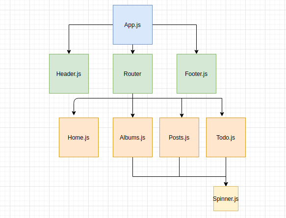

# Placeholder

> A demo application and learning experience for use with other cloud based projects.

 

Placeholder is a small but functional application that drives home ReactJS concepts to put together User Interfaces to pair up with back end projects.

* Its criteria are : 
    * Component tree based architecture
    * Resuable components
    * Props
    * State
    * Bootstrap 5.1 for CSS

## Architecture

An Asynchronous GET request is initiated in App.JS to obtain user information for User #3 located at ``https://jsonplaceholder.typicode.com/users/3`` . That JSON is parsed and set in the applications State. That state is used as a prop and passed down to every component in the tree (except Spinner - which is used for UX). 

## Installation
Clone the repository ``cd`` into the directory and then ``npm start``. Should run on localhost:3000

If you don't have node installed, a Docker image is available on dockerhub: jhart87/jsonplaceholder:latest

## Release History

* 1.0.0
    * Initial Release

## Contributing

1. If you feel like contributing please submit any pull requests on the master branch. 

<!-- Markdown link & img dfn's -->
[npm-image]: https://img.shields.io/npm/v/datadog-metrics.svg?style=flat-square
[npm-url]: https://npmjs.org/package/datadog-metrics
[npm-downloads]: https://img.shields.io/npm/dm/datadog-metrics.svg?style=flat-square
[travis-image]: https://img.shields.io/travis/dbader/node-datadog-metrics/master.svg?style=flat-square
[travis-url]: https://travis-ci.org/dbader/node-datadog-metrics
[wiki]: https://github.com/yourname/yourproject/wiki